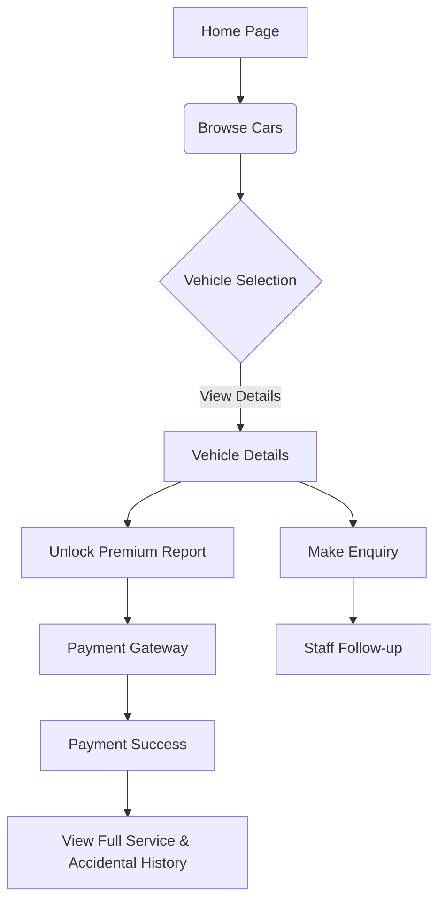
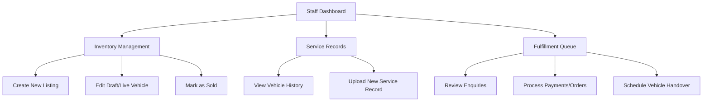
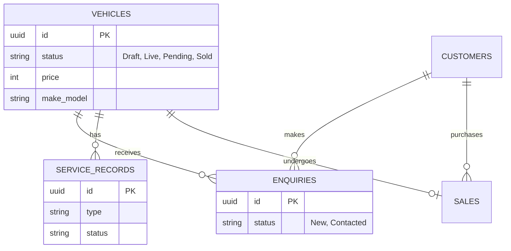

# Tribe Motors Marketplace

## About Tribe Motors

Tribe Motors is a premium concierge marketplace for verified, transparent pre-owned cars located in Visakhapatnam. The platform focuses on providing high-quality, meticulously inspected vehicles with full service histories, ensuring a community-backed and reliable buying experience. The website features a customer-facing portal to browse and purchase vehicles (including premium vehicle reports), and a staff portal for managing inventory, service records, and customer fulfillment.

## Pages Overview

### Client-Side (Customer Facing)

These pages are designed for prospective buyers to find, evaluate, and purchase their next vehicle.

1. **Home - Tribe Motors**
   - The landing page introducing the brand's concierge approach.
   - Features a quick search form (by Make, Model, Max Price).
   - Highlights the platform's core values: "Every car inspected," "Full service history," and "Community-backed."
   - Displays a curated list of featured vehicles.

2. **Browse Cars - Tribe Motors**
   - The main inventory discovery page.
   - Allows users to view all available pre-owned vehicles.
   - Includes advanced filtering and sorting options to help customers find exactly what they are looking for.

3. **Vehicle Details - Tribe Motors**
   - A dedicated page for a specific vehicle.
   - Displays high-quality images, comprehensive specifications (make, model, year, mileage, transmission, fuel type, price), and a detailed description.
   - Provides options for customers to contact the seller or initiate a purchase/enquiry.

4. **Unlock Report - Payment**
   - A gateway page where customers can pay to access premium, detailed vehicle inspection and history reports.
   - Ensures transparency by offering full service and accidental history documentation for a fee.

5. **Payment Success**
   - The confirmation page displayed after a successful transaction (e.g., unlocking a report or placing a deposit).
   - Provides next steps and transaction receipts.

### Admin-Side (Staff Portal)

These pages are restricted to authorized personnel (Admins and Staff) to manage the platform's operations.

1. **Staff Portal - Dashboard**
   - The central hub for staff members.
   - Provides an overview of recent activities, new enquiries, pending tasks, and high-level platform metrics.

2. **Staff Portal - Service Records**
   - A management page to view and track the service and maintenance history of all vehicles in the inventory.
   - Helps ensure that all vehicles meet Tribe Motors' quality standards before sale.

3. **Staff Portal - Upload Service Record**
   - A utility page allowing staff to digitize and attach new service documents (e.g., oil changes, repairs) to specific vehicles.
   - Maintains the transparency promise for customers.

4. **Fulfillment Queue - Staff**
   - A workflow management page tracking customer orders, enquiries, and pending vehicle handovers.
   - Ensures timely and premium customer service.

5. **Inventory - View Mode**
    - A comprehensive list of all vehicles currently managed by the platform (Draft, Live, Pending, Sold).
    - Allows staff to monitor the status and details of the entire fleet.

6. **Inventory - Create/Edit Mode**
    - The data entry interface for adding new vehicles to the platform or updating existing listings.
    - Staff can input all necessary vehicle metadata (price, mileage, features, images) to publish to the client-side Browse page.

7. **Tribe Motors Platform Flow**
    - Documentation outlining the end-to-end journey of a vehicle on the platform, from acquisition and inspection by staff to listing, customer enquiry, payment, and final fulfillment.

## Platform Architecture & Workflows

### 1. Client Journey Flow

### 2. Admin & Staff Workflow

### 3. Data Entities (ER Diagram)

